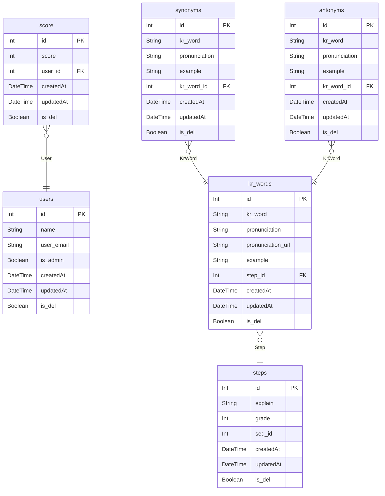

# solibyeoli ERD
> Generated by [`prisma-markdown`](https://github.com/samchon/prisma-markdown)

- [default](#default)

## default

### `users`

**Properties**
  - `id`: 
  - `name`: 
  - `user_email`: 
  - `is_admin`: 
  - `createdAt`: 
  - `updatedAt`: 
  - `is_del`: 

### `score`

**Properties**
  - `id`: 
  - `score`: 
  - `user_id`: 
  - `createdAt`: 
  - `updatedAt`: 
  - `is_del`: 

### `steps`

**Properties**
  - `id`: 
  - `explain`: 
  - `grade`: 
  - `seq_id`: 
  - `createdAt`: 
  - `updatedAt`: 
  - `is_del`: 

### `kr_words`

**Properties**
  - `id`: 
  - `kr_word`: 
  - `pronunciation`: 
  - `pronunciation_url`: 
  - `example`: 
  - `step_id`: 
  - `createdAt`: 
  - `updatedAt`: 
  - `is_del`: 

### `synonyms`

**Properties**
  - `id`: 
  - `kr_word`: 
  - `pronunciation`: 
  - `example`: 
  - `kr_word_id`: 
  - `createdAt`: 
  - `updatedAt`: 
  - `is_del`: 

### `antonyms`

**Properties**
  - `id`: 
  - `kr_word`: 
  - `pronunciation`: 
  - `example`: 
  - `kr_word_id`: 
  - `createdAt`: 
  - `updatedAt`: 
  - `is_del`: 