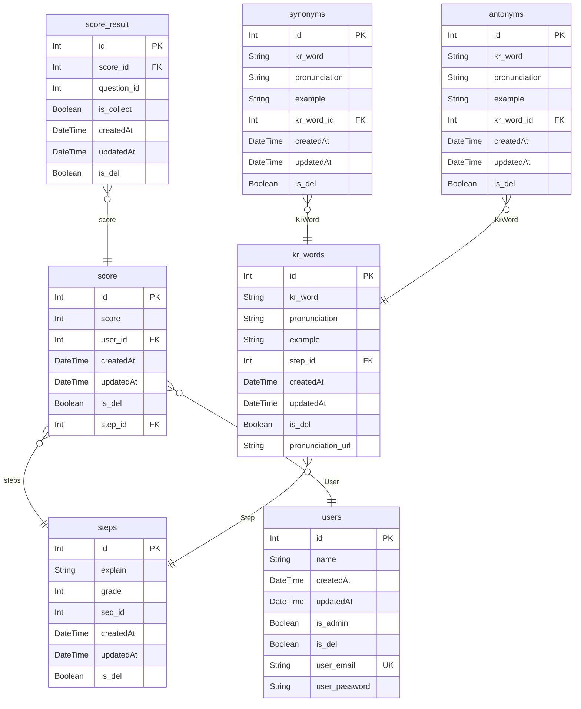

# solibyeoli ERD
> Generated by [`prisma-markdown`](https://github.com/samchon/prisma-markdown)

- [default](#default)

## default

### `users`
사용자 테이블

**Properties**
  - `id`: pk
  - `name`: 이름
  - `createdAt`: 생성일
  - `updatedAt`: 수정일
  - `is_admin`: 관리자 여부
  - `is_del`: 삭제 여부
  - `user_email`: 유저 아이디
  - `user_password`: 유저 비밀번호

### `score`
사용자 점수 테이블

**Properties**
  - `id`: pk
  - `score`: 점수
  - `user_id`: 유저 테이블 fk
  - `createdAt`: 생성일
  - `updatedAt`: 수정일
  - `is_del`: 삭제 여부
  - `step_id`: 

### `steps`
차시(공부 차시) 테이블

**Properties**
  - `id`: pk
  - `explain`: 설명
  - `grade`: 학년
  - `seq_id`: 차시 순서
  - `createdAt`: 생성일
  - `updatedAt`: 수정일
  - `is_del`: 삭제 여부

### `kr_words`
해당 차시의 단어 테이블

**Properties**
  - `id`: pk
  - `kr_word`: 단어
  - `pronunciation`: 발음
  - `example`: 예시
  - `step_id`: 차시 테이블 fk
  - `createdAt`: 생성일
  - `updatedAt`: 수정일
  - `is_del`: 삭제 여부
  - `pronunciation_url`: 발음 파일 url

### `synonyms`
유의어

**Properties**
  - `id`: pk
  - `kr_word`: 유의어 단어
  - `pronunciation`: 발음
  - `example`: 예시
  - `kr_word_id`: 원래 단어 fk
  - `createdAt`: 생성일
  - `updatedAt`: 수정일
  - `is_del`: 삭제 여부

### `antonyms`
반의어

**Properties**
  - `id`: pk
  - `kr_word`: 반의어 단어
  - `pronunciation`: 발음
  - `example`: 예시
  - `kr_word_id`: 원래 단어 fk
  - `createdAt`: 생성일
  - `updatedAt`: 수정일
  - `is_del`: 삭제 여부

### `score_result`

**Properties**
  - `id`: 
  - `score_id`: 
  - `question_id`: 
  - `is_collect`: 
  - `createdAt`: 
  - `updatedAt`: 
  - `is_del`: 